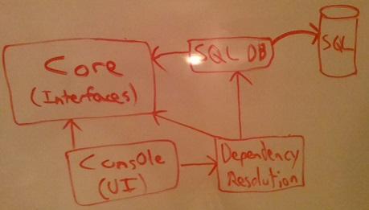

Learning IoC
================

Playing around with various IoC containers in various scenarios.

## The flow of dependencies

* `Core` depends on **nothing**. This is a good thing!
* `*Dependency` projects (SQL, PayPal, etc.) depend on `Core` (for interface/contract definitions).
* `DependencyResolution` depends on `Core` (for interfaces), `*Dependency` (for implementation), and `Ninject` (via NuGet, to wire up IoC).
* `UI Projects` (Console, Web Forms, MVC, etc.) depend on `Core` (for interfaces) and `DependencyResolution` (to initialize IoC and retrieve instances of interfaces).
  * Nothing depends on any of the `UI Projects`

With this setup, `Core` is free of any dependencies, and the rest of your project is actually not even dependent on which IoC container you choose to use (the only thing that knows which IoC you're using is `DependencyResolution`). Your UI need only know about your `Core` and `DependencyResolution` projects, without any concern for concrete implementations.
